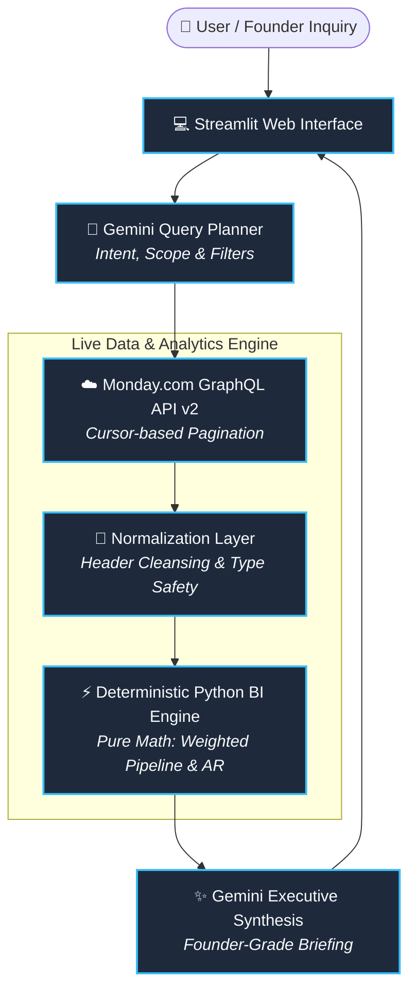

# Skylark Drones — Monday.com Executive BI Agent

[](https://monday-bi-agent-tpkw9goarvf7avfcbrzjtc.streamlit.app/)

An AI-powered Business Intelligence Agent that answers founder-level commercial and operational queries by querying live Monday.com Deals and Work Orders boards dynamically via GraphQL API v2.

---

## 🌐 Live Hosted Prototype
- **Live URL**: [https://monday-bi-agent-tpkw9goarvf7avfcbrzjtc.streamlit.app/](https://monday-bi-agent-tpkw9goarvf7avfcbrzjtc.streamlit.app/)
- **GitHub Repository**: [https://github.com/hiransuresh/monday-bi-agent](https://github.com/hiransuresh/monday-bi-agent)

---

## 🏛️ System Architecture
## 🏛️ System Architecture


---

## ✨ Core Features & Highlights

* **Dynamic GraphQL API Integration**: Full cursor-based pagination over Deals and Work Orders boards with zero hardcoded CSV dependencies.
* **Messy Data Resilience**:
  * Safely strips mid-sheet duplicate headers (`Deal Status == 'Deal Status'`).
  * Handles null closure probabilities with explicit audit caveats.
  * Retains and highlights negative AR and negative unbilled records transparently.
* **Deterministic Arithmetic**: Numerical calculations (weighted pipeline, win rates, collections, and AR) are computed strictly in Python, eliminating LLM mathematical hallucination.
* **Cross-Board Leadership Briefings**: Combines commercial pipeline velocity with project execution and accounts receivable health.
* **Executive Formatting**: Briefings are structured into Executive Summary, Key Numbers, Strategic Context, Data Quality Caveats, and Recommended Actions.

---

## 📊 Ground Truth Benchmarks

| Metric | Source Board | Value |
| :--- | :--- | :--- |
| **Total Open Deals** | Deals | `49 deals` |
| **Open Pipeline Value (Usable)** | Deals | `₹688,152,293.17` |
| **Weighted Pipeline Value** | Deals | `₹258,997,608.51` |
| **Total Work Orders** | Work Orders | `176 items` |
| **Completed Work Orders** | Work Orders | `117 items (66.5%)` |
| **At-Risk Projects** | Work Orders | `5 projects` |
| **Contracted Value (Incl GST)** | Work Orders | `₹249,746,302.87` |
| **Billed Value (Incl GST)** | Work Orders | `₹126,719,936.37` |
| **Collected Amount (Incl GST)** | Work Orders | `₹90,428,187.50` |
| **Outstanding Receivables (AR)** | Work Orders | `₹36,291,748.87` |

---

## 🚀 Local Setup & Installation

**1. Clone the Repository**:
```bash
git clone [https://github.com/hiransuresh/monday-bi-agent.git](https://github.com/hiransuresh/monday-bi-agent.git)
cd monday-bi-agent
